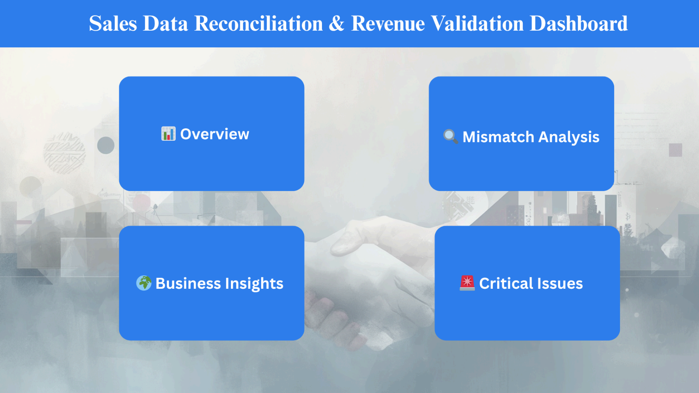
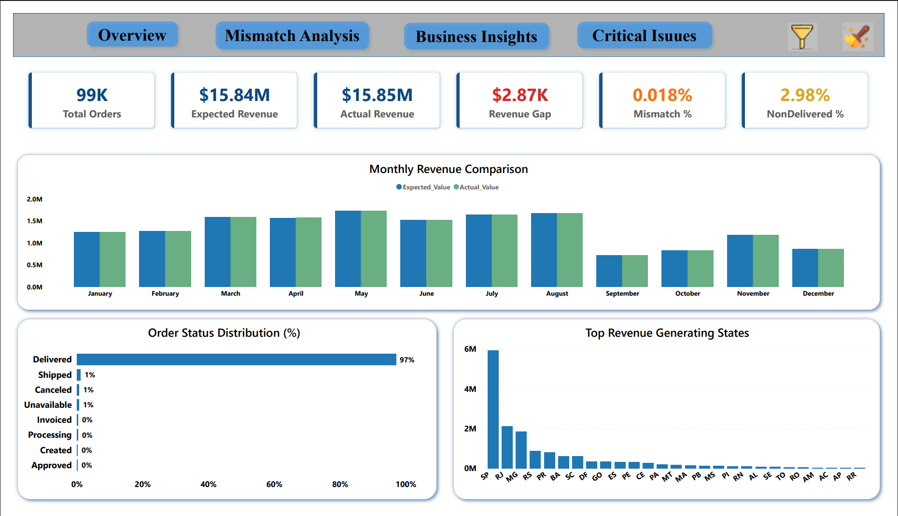

# 📊 Sales Data Reconciliation & Revenue Validation

## 📌 Problem Statement
Ensuring revenue accuracy is critical for financial reporting and business decision-making. However, discrepancies can arise between expected order values (based on order items) and actual payments received due to multiple transactions, cancellations, and operational issues.

This project addresses the challenge of identifying and analyzing revenue mismatches to improve financial accuracy and operational efficiency.

---

## 🎯 Objective
- Validate revenue accuracy across datasets  
- Identify mismatches between expected and actual revenue  
- Analyze root causes of discrepancies  
- Provide actionable business insights  

---

## 🛠️ Tools & Technologies
- **Python** – Data cleaning and preprocessing  
- **SQL** – Data reconciliation and analysis (stored procedures)  
- **Power BI** – Dashboard and visualization  

---

# 📊 Dashboard Pages

## 🏠 Home

---

## 📊 Overview

---

## 🔍 Mismatch Analysis

---

## 🌍 Business Insights

---

## 🚨 Critical Issues

---

The interactive dashboard includes:
- KPI monitoring (Total Revenue, Mismatch %, Orders)  
- Mismatch analysis by state and order status  
- Customer contribution insights  
- Risk-based conditional formatting  

---

## 🔍 Key Insights
- Revenue mismatch is minimal (~0.018%), indicating strong financial alignment  
- Discrepancies are concentrated in cancelled and shipped orders  
- Specific states contribute the majority of mismatch  
- Top 10 customers contribute <1%, indicating a highly diversified customer base  

---

## 💡 Business Recommendations
- Improve reconciliation for cancelled and shipped orders  
- Focus on high-risk states for operational improvements  
- Monitor recurring discrepancies  
- Optimize payment and delivery processes  
- Increase customer value through targeted strategies  

---

## 🗄️ SQL Implementation
The project uses modular stored procedures for scalable and reusable analysis:

- **Reconciliation Procedure** – Calculates expected vs actual revenue  
- **Analysis Procedures** – Computes mismatch %, revenue impact, distribution, and top discrepancies  
- **Master Procedure** – Automates the entire reconciliation pipeline  

---

## 📁 Project Structure
Sales-Reconciliation-Revenue-Validation/
│
├── dashboard/ # Power BI template & screenshots
├── sql/ # Stored procedures (procedures.sql), views(vw_reconciliation)
├── python/ # Data preparation scripts
├── data/ # Sample datasets
├── report/ # Final report (PDF)
└── README.md

---

## 📂 Data
Sample datasets are provided to demonstrate structure and relationships.  
The full dataset was used for analysis but is not included due to size constraints.

---

## 🚀 Key Highlights
- End-to-end data reconciliation pipeline  
- SQL-based modular procedure design  
- Interactive Power BI dashboard  
- Business-focused insights and recommendations  

---

## 📌 Conclusion
The analysis confirms strong overall revenue alignment, with minimal mismatch (~0.018%).  
However, targeted improvements in specific order statuses and regions can further enhance financial accuracy and operational efficiency.

---
